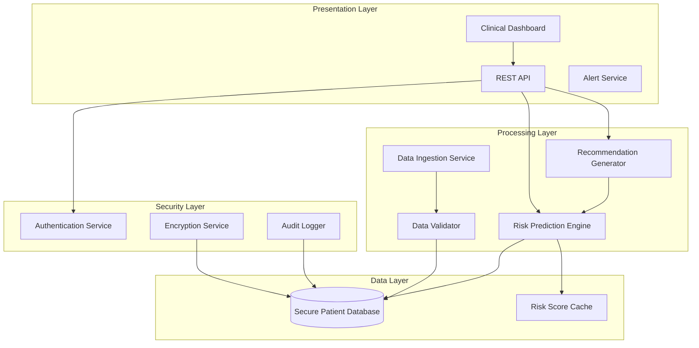

# Design Document: Healthcare Disease Risk Prediction System

## Overview

The Healthcare Disease Risk Prediction System is an AI-powered platform that analyzes patient data to predict disease risks and provide preventive care recommendations. The system processes multiple data sources including demographics, medical history, symptoms, and lifestyle factors to generate risk scores and actionable insights for healthcare providers.

The architecture follows a layered approach with clear separation between data ingestion, AI processing, clinical decision support, and secure storage layers. The system prioritizes data security, HIPAA compliance, and clinical accuracy while providing real-time risk assessments through an intuitive dashboard interface.

## Architecture

### System Components



### Data Flow

1. **Patient Data Ingestion**: Patient data enters through the Data Ingestion Service
2. **Validation**: Data Validator ensures data quality and completeness
3. **Storage**: Validated data is encrypted and stored in the Secure Patient Database
4. **Risk Analysis**: Risk Prediction Engine retrieves patient data and calculates risk scores
5. **Recommendation Generation**: Recommendation Generator creates preventive care suggestions
6. **Presentation**: Clinical Dashboard displays risk scores and recommendations
7. **Audit Trail**: All access and modifications are logged for compliance

## Components and Interfaces

### 1. Data Ingestion Service

**Responsibility**: Accept and preprocess patient data from various sources

**Interface**:
```python
class DataIngestionService:
    def ingest_patient_data(patient_id: str, data: PatientData) -> IngestionResult
    def batch_ingest(patients: List[PatientData]) -> BatchResult
    def validate_data_format(data: PatientData) -> ValidationResult
```

**Key Operations**:
- Accept patient demographics (age, gender, ethnicity)
- Process medical history records
- Capture current symptoms
- Record lifestyle factors (smoking, exercise, diet)
- Normalize data formats across different sources

### 2. Data Validator

**Responsibility**: Ensure data quality, completeness, and consistency

**Interface**:
```python
class DataValidator:
    def validate_patient_data(data: PatientData) -> ValidationResult
    def check_required_fields(data: PatientData) -> List[MissingField]
    def validate_data_ranges(data: PatientData) -> List[ValidationError]
    def sanitize_input(data: PatientData) -> PatientData
```

**Validation Rules**:
- Age must be between 0 and 150
- Medical codes must match standard terminologies (ICD-10, SNOMED)
- Dates must be chronologically consistent
- Numeric values must be within physiological ranges

### 3. Risk Prediction Engine

**Responsibility**: Calculate disease risk scores using AI models

**Interface**:
```python
class RiskPredictionEngine:
    def calculate_risk_score(patient_id: str, disease: DiseaseType) -> RiskScore
    def calculate_all_risks(patient_id: str) -> Dict[DiseaseType, RiskScore]
    def get_risk_factors(patient_id: str, disease: DiseaseType) -> List[RiskFactor]
    def update_model(model_data: ModelParameters) -> UpdateResult
```

**AI Model Features**:
- Multi-disease prediction (diabetes, cardiovascular, cancer, respiratory)
- Feature importance analysis
- Confidence intervals for predictions
- Model versioning and A/B testing support

**Risk Score Structure**:
```python
class RiskScore:
    disease: DiseaseType
    score: float  # 0.0 to 1.0
    confidence: float  # 0.0 to 1.0
    risk_level: RiskLevel  # LOW, MODERATE, HIGH, CRITICAL
    contributing_factors: List[RiskFactor]
    timestamp: datetime
```

### 4. Recommendation Generator

**Responsibility**: Generate personalized preventive care recommendations

**Interface**:
```python
class RecommendationGenerator:
    def generate_recommendations(patient_id: str, risk_scores: Dict[DiseaseType, RiskScore]) -> List[Recommendation]
    def prioritize_recommendations(recommendations: List[Recommendation]) -> List[Recommendation]
    def get_evidence_base(recommendation: Recommendation) -> List[ClinicalEvidence]
```

**Recommendation Types**:
- Lifestyle modifications (diet, exercise, smoking cessation)
- Screening tests and frequency
- Specialist referrals
- Medication considerations
- Follow-up scheduling

### 5. Secure Patient Database

**Responsibility**: Store patient data with encryption and access control

**Interface**:
```python
class SecurePatientDatabase:
    def store_patient(patient: PatientData) -> StorageResult
    def retrieve_patient(patient_id: str, requester: User) -> PatientData
    def update_patient(patient_id: str, updates: PatientData) -> UpdateResult
    def delete_patient(patient_id: str, requester: User) -> DeletionResult
    def query_patients(criteria: QueryCriteria) -> List[PatientData]
```

**Security Features**:
- AES-256 encryption at rest
- TLS 1.3 for data in transit
- Role-based access control (RBAC)
- Field-level encryption for sensitive data
- Automatic data retention and purging

### 6. Clinical Dashboard

**Responsibility**: Present risk information to healthcare providers

**Interface**:
```python
class ClinicalDashboard:
    def display_patient_overview(patient_id: str) -> DashboardView
    def show_risk_trends(patient_id: str, timeframe: TimeRange) -> TrendView
    def display_recommendations(patient_id: str) -> RecommendationView
    def generate_report(patient_id: str, format: ReportFormat) -> Report
```

**Dashboard Features**:
- Risk score visualization (gauges, charts, trends)
- Color-coded risk levels
- Filterable patient lists
- Comparative analytics
- Export capabilities (PDF, CSV)

### 7. Authentication Service

**Responsibility**: Manage user authentication and authorization

**Interface**:
```python
class AuthenticationService:
    def authenticate_user(credentials: Credentials) -> AuthToken
    def authorize_action(user: User, action: Action, resource: Resource) -> bool
    def refresh_token(token: AuthToken) -> AuthToken
    def revoke_access(user: User) -> RevokeResult
```

**Security Mechanisms**:
- Multi-factor authentication (MFA)
- OAuth 2.0 / OpenID Connect
- Session management
- Password policies
- Account lockout protection

### 8. Audit Logger

**Responsibility**: Track all system access and modifications for compliance

**Interface**:
```python
class AuditLogger:
    def log_access(user: User, resource: Resource, action: Action) -> LogEntry
    def log_modification(user: User, resource: Resource, changes: Dict) -> LogEntry
    def query_audit_log(criteria: AuditCriteria) -> List[LogEntry]
    def generate_compliance_report(timeframe: TimeRange) -> ComplianceReport
```

**Logged Events**:
- Patient data access
- Risk score calculations
- Data modifications
- Authentication events
- System configuration changes

## Data Models

### PatientData

```python
class PatientData:
    patient_id: str
    demographics: Demographics
    medical_history: MedicalHistory
    current_symptoms: List[Symptom]
    lifestyle_factors: LifestyleFactors
    created_at: datetime
    updated_at: datetime
```

### Demographics

```python
class Demographics:
    age: int
    gender: Gender
    ethnicity: Ethnicity
    height: float  # cm
    weight: float  # kg
    bmi: float  # calculated
```

### MedicalHistory

```python
class MedicalHistory:
    diagnoses: List[Diagnosis]
    medications: List[Medication]
    procedures: List[Procedure]
    family_history: List[FamilyCondition]
    allergies: List[Allergy]
    lab_results: List[LabResult]
```

### LifestyleFactors

```python
class LifestyleFactors:
    smoking_status: SmokingStatus
    alcohol_consumption: AlcoholLevel
    exercise_frequency: ExerciseLevel
    diet_quality: DietQuality
    sleep_hours: float
    stress_level: StressLevel
```

### RiskFactor

```python
class RiskFactor:
    factor_name: str
    factor_type: FactorType  # DEMOGRAPHIC, MEDICAL, LIFESTYLE
    contribution: float  # -1.0 to 1.0 (negative = protective)
    modifiable: bool
    description: str
```

### Recommendation

```python
class Recommendation:
    recommendation_id: str
    category: RecommendationType
    priority: Priority
    title: str
    description: str
    evidence_level: EvidenceLevel
    expected_impact: float
    actionable_steps: List[str]
```

## Correctness Properties

*A property is a characteristic or behavior that should hold true across all valid executions of a system—essentially, a formal statement about what the system should do. Properties serve as the bridge between human-readable specifications and machine-verifiable correctness guarantees.*


### Property 1: Risk Score Validity

*For any* valid patient data, when a risk score is calculated, the score value must be between 0.0 and 1.0, the confidence value must be between 0.0 and 1.0, all contributing risk factors must have contribution values between -1.0 and 1.0, and the risk level classification (LOW, MODERATE, HIGH, CRITICAL) must correctly correspond to the score value according to defined thresholds.

**Validates: Requirements TBD**

### Property 2: Input Validation and Sanitization

*For any* patient data input, the validation process must reject data with invalid fields (age outside 0-150 range, invalid medical codes, chronologically inconsistent dates, out-of-range numeric values) and must sanitize potentially harmful content (SQL injection patterns, XSS attempts) before storage, while accepting and preserving all valid data unchanged.

**Validates: Requirements TBD**

### Property 3: Encryption Round Trip

*For any* patient data, encrypting the data for storage and then decrypting it for retrieval must produce data equivalent to the original, preserving all fields and values exactly.

**Validates: Requirements TBD**

### Property 4: Recommendation Relevance and Prioritization

*For any* patient with calculated risk scores, the generated recommendations must be relevant to the identified high-risk diseases, and when prioritized, recommendations with higher priority levels must appear before those with lower priority levels in the returned list.

**Validates: Requirements TBD**

### Property 5: Authorization Consistency

*For any* user attempting to access or modify patient data, access must be granted only when the user is properly authenticated and authorized for that specific action and resource, and authorization decisions must remain consistent unless user permissions are explicitly modified.

**Validates: Requirements TBD**

### Property 6: Audit Log Completeness

*For any* data access operation, data modification operation, or authentication event, a corresponding audit log entry must be created containing the user, resource, action, timestamp, and outcome.

**Validates: Requirements TBD**

### Property 7: BMI Calculation Consistency

*For any* patient demographics with height and weight values, the calculated BMI must equal weight(kg) / (height(m))² within a tolerance of 0.01.

**Validates: Requirements TBD**

### Property 8: Timestamp Ordering Invariant

*For any* patient record, the updated_at timestamp must always be greater than or equal to the created_at timestamp.

**Validates: Requirements TBD**

### Property 9: Risk Factor Modifiability Classification

*For any* risk factor identified in a risk calculation, factors classified as modifiable must be of types that can be changed through patient behavior or medical intervention (lifestyle factors, certain medical conditions), while non-modifiable factors must be inherent characteristics (age, gender, genetic factors).

**Validates: Requirements TBD**

### Property 10: Multi-Disease Risk Independence

*For any* patient, calculating the risk score for one disease type must not affect the risk scores calculated for other disease types when calculated independently.

**Validates: Requirements TBD**

### Property 11: Data Retention Compliance

*For any* patient data stored in the system, if the data age exceeds the configured retention period and no active treatment relationship exists, the data must be automatically purged from the system.

**Validates: Requirements TBD**

### Property 12: Query Result Authorization

*For any* patient query with specified criteria, all returned patient records must be records that the requesting user is authorized to access, and no unauthorized records must be included in the results.

**Validates: Requirements TBD**

## Error Handling

### Error Categories

**1. Validation Errors**
- Invalid patient data format
- Missing required fields
- Out-of-range values
- Invalid medical codes

**Response**: Return detailed validation error messages with field-level feedback. HTTP 400 Bad Request.

**2. Authentication Errors**
- Invalid credentials
- Expired tokens
- Missing authentication headers
- MFA failures

**Response**: Return generic authentication failure message (avoid revealing specifics for security). HTTP 401 Unauthorized.

**3. Authorization Errors**
- Insufficient permissions
- Accessing unauthorized patient records
- Attempting restricted operations

**Response**: Return authorization failure message. Log attempt for security monitoring. HTTP 403 Forbidden.

**4. Data Not Found Errors**
- Patient ID does not exist
- Risk score not yet calculated
- Requested resource missing

**Response**: Return not found message with resource identifier. HTTP 404 Not Found.

**5. AI Model Errors**
- Model prediction failure
- Insufficient data for prediction
- Model version mismatch
- Feature extraction errors

**Response**: Return error indicating prediction unavailable. Log error for model monitoring. Fallback to previous model version if available. HTTP 503 Service Unavailable.

**6. Database Errors**
- Connection failures
- Query timeouts
- Constraint violations
- Encryption/decryption failures

**Response**: Return generic database error message (avoid exposing internal details). Log full error details. Retry transient failures. HTTP 500 Internal Server Error.

**7. Compliance Violations**
- Audit log write failure
- Encryption failure
- Data retention policy violation
- Access pattern anomaly

**Response**: Block the operation. Alert security team. Return compliance error message. HTTP 500 Internal Server Error.

### Error Handling Strategies

**Retry Logic**:
- Transient database failures: 3 retries with exponential backoff
- API timeouts: 2 retries with 1-second delay
- Model prediction failures: Fallback to previous model version

**Circuit Breaker**:
- Open circuit after 5 consecutive failures
- Half-open state after 30 seconds
- Close circuit after 3 successful requests

**Graceful Degradation**:
- If Risk Prediction Engine fails: Display cached risk scores with staleness indicator
- If Recommendation Generator fails: Display generic preventive care guidelines
- If Dashboard fails: Provide read-only API access

**Logging and Monitoring**:
- Log all errors with correlation IDs
- Track error rates by category
- Alert on error rate thresholds
- Monitor model prediction accuracy

## Testing Strategy

### Dual Testing Approach

The system requires both unit testing and property-based testing for comprehensive coverage:

**Unit Tests**: Verify specific examples, edge cases, and error conditions
- Specific patient scenarios with known outcomes
- Edge cases (minimum/maximum ages, boundary values)
- Error conditions (invalid inputs, missing data)
- Integration points between components
- Mock external dependencies

**Property Tests**: Verify universal properties across all inputs
- Universal correctness properties that hold for all valid inputs
- Comprehensive input coverage through randomization
- Minimum 100 iterations per property test
- Each property test references its design document property

### Property-Based Testing Framework

**Framework Selection**: 
- Python: Use `hypothesis` library
- TypeScript/JavaScript: Use `fast-check` library
- Java: Use `jqwik` library

**Configuration**:
- Minimum 100 iterations per property test
- Shrinking enabled to find minimal failing examples
- Seed-based reproducibility for failed tests
- Timeout: 30 seconds per property test

**Test Tagging**:
Each property test must include a comment tag:
```python
# Feature: healthcare-disease-risk-prediction, Property 1: Risk Score Validity
```

### Test Coverage Requirements

**Unit Test Coverage**:
- Data validation logic: 100%
- Risk calculation algorithms: 95%
- Recommendation generation: 90%
- Authentication/authorization: 100%
- Error handling paths: 85%

**Property Test Coverage**:
- All 12 correctness properties must have corresponding property tests
- Each property test must reference its design property number
- Property tests must generate diverse, realistic patient data

### Integration Testing

**Component Integration**:
- Data Ingestion → Validator → Database
- Risk Prediction Engine → Recommendation Generator
- Authentication → Authorization → Data Access
- Audit Logger integration with all operations

**End-to-End Scenarios**:
- Complete patient risk assessment workflow
- Dashboard data retrieval and display
- Multi-user concurrent access
- Data retention and purging

### Security Testing

**Penetration Testing**:
- SQL injection attempts
- XSS attacks
- Authentication bypass attempts
- Authorization escalation attempts
- Data encryption verification

**Compliance Testing**:
- HIPAA compliance verification
- Audit log completeness
- Data retention policy enforcement
- Access control validation

### Performance Testing

**Load Testing**:
- 1000 concurrent users
- 10,000 risk calculations per minute
- Database query performance under load
- API response time < 200ms (95th percentile)

**Stress Testing**:
- System behavior at 150% expected load
- Recovery from resource exhaustion
- Database connection pool limits
- Memory leak detection

### Test Data Management

**Synthetic Patient Data**:
- Generate realistic patient profiles
- Cover diverse demographics
- Include edge cases (very young, very old, rare conditions)
- Ensure privacy (no real patient data in tests)

**Property Test Generators**:
```python
# Example generator for patient data
@given(
    age=st.integers(min_value=0, max_value=150),
    weight=st.floats(min_value=2.0, max_value=300.0),
    height=st.floats(min_value=30.0, max_value=250.0),
    smoking_status=st.sampled_from(SmokingStatus),
    medical_history=st.lists(st.from_type(Diagnosis), max_size=20)
)
def test_risk_score_validity(age, weight, height, smoking_status, medical_history):
    # Property 1 test implementation
    pass
```

### Continuous Testing

**CI/CD Integration**:
- Run unit tests on every commit
- Run property tests on every pull request
- Run integration tests before deployment
- Run security tests weekly
- Run performance tests before major releases

**Test Monitoring**:
- Track test execution time trends
- Monitor flaky test rates
- Alert on test coverage drops
- Dashboard for test health metrics

## Deployment Considerations

### Infrastructure Requirements

**Compute**:
- Application servers: 4 vCPUs, 16GB RAM (minimum 3 instances)
- AI model inference: GPU-enabled instances (NVIDIA T4 or better)
- Database: 8 vCPUs, 32GB RAM, SSD storage

**Storage**:
- Patient database: Encrypted SSD with automatic backups
- Audit logs: Append-only storage with 7-year retention
- Model artifacts: Versioned object storage

**Network**:
- Load balancer with SSL/TLS termination
- Private subnets for database and AI services
- VPN access for administrative operations

### Compliance and Regulatory

**HIPAA Compliance**:
- Business Associate Agreements (BAA) with cloud providers
- Encryption at rest and in transit
- Access controls and audit logging
- Regular security assessments
- Incident response procedures

**Data Governance**:
- Data classification and labeling
- Privacy impact assessments
- Data retention and disposal policies
- Cross-border data transfer restrictions

### Monitoring and Observability

**Metrics**:
- API response times and error rates
- Risk calculation latency
- Database query performance
- Model prediction accuracy
- Authentication success/failure rates

**Logging**:
- Structured logging with correlation IDs
- Centralized log aggregation
- Log retention per compliance requirements
- Sensitive data redaction in logs

**Alerting**:
- Error rate thresholds
- Performance degradation
- Security anomalies
- Compliance violations
- Model accuracy drift

### Disaster Recovery

**Backup Strategy**:
- Database: Continuous replication with point-in-time recovery
- Audit logs: Replicated to separate region
- Model artifacts: Multi-region storage

**Recovery Objectives**:
- Recovery Time Objective (RTO): 4 hours
- Recovery Point Objective (RPO): 15 minutes
- Regular disaster recovery drills

## Future Enhancements

### Planned Features

**Advanced AI Capabilities**:
- Explainable AI (XAI) for risk factor interpretation
- Federated learning for privacy-preserving model training
- Real-time risk monitoring with streaming data
- Predictive modeling for treatment outcomes

**Clinical Integration**:
- HL7 FHIR API for EHR integration
- Clinical decision support system (CDSS) integration
- Telemedicine platform integration
- Wearable device data integration

**Analytics and Reporting**:
- Population health analytics
- Risk stratification for care management
- Predictive resource allocation
- Quality measure reporting

**User Experience**:
- Mobile application for providers
- Patient portal for risk awareness
- Natural language query interface
- Customizable dashboard layouts

### Scalability Roadmap

**Phase 1** (Current): Support 10,000 patients, 100 concurrent users
**Phase 2** (6 months): Support 100,000 patients, 500 concurrent users
**Phase 3** (12 months): Support 1,000,000 patients, 2,000 concurrent users
**Phase 4** (24 months): Multi-tenant architecture for healthcare networks

---

*This design document provides a comprehensive blueprint for implementing the Healthcare Disease Risk Prediction System. All design decisions prioritize patient safety, data security, regulatory compliance, and clinical utility.*
